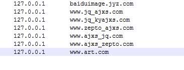
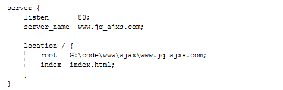
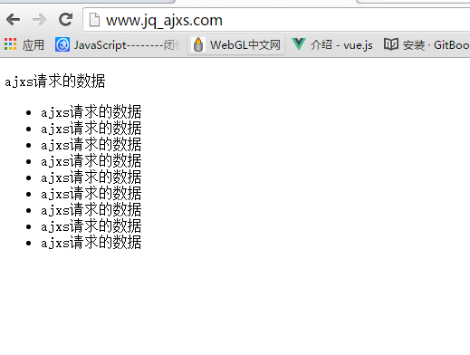
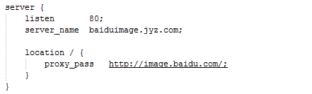

# nginx的应用
### 官网（nginx.org）
>nginx可以做
1.web服务（http服务）
2.http代理服务
3负载均衡
在官网（nginx.org）如下图处下载
先点击

跳转下一页点击（nginx/winsows-1.10.3)下载

下载后解压得到如下图的一个文件夹

点进去如下图

### 常用的3个命令
>执行nginx命令须在你的nginx文件夹下 按Shift+鼠标右键选择（在此处打开命令行窗口）输入以下命令；
启动：start nginx
重启：nginx -s reload （nginx.conf文件改动执行此命令）
停用：nginx -s stop

### 快捷启动方式
>创建一个txt文件
内容：
e:   (nginx所在盘)
cd E:\nginx\nginx-1.10.3 （nginx所在地）
start nginx （启动nginx）
然后把这个txt文件后缀改为bat名字根据需求定，点击这个文件夹可以在启动nginx，这个文件夹可以放在任何地方。其他快捷启动方式类似。

## 注意本地文件夹命名不要用中文和不要带有nginx；

## 本地web服务
>在hosts文件修改如下图

>hosts文件地址（C:\Windows\System32\drivers\etc）下
修改nginx/conf/nginx.conf文件，添加如下图内容，内容须在http{ }内

>root是（server_name：www.jq_ajxs.com）代理的本地文件夹的地址，启动nginx

>在浏览器输入www.jq_ajxs.com

>页面显示的是本地（G:\code\www\ajax\www.jq_ajxs.com\index.html）

## http代理服务
>hosts文件的baiduimage.jyz.com代理的是http://image.baidu.com/
修改nginx/conf/nginx.conf文件，添加如下图内容，内容须在http{ }内

>启动nginx,注意location里不是root是prosy_pass

>原本输入http://image.baidu.com/ 的网站现在输入baiduimage.jyz.com也可以显示

## 负载均衡
http://nginx.org/en/docs/http/load_balancing.html
>此处有详情介绍我就不过多介绍了
